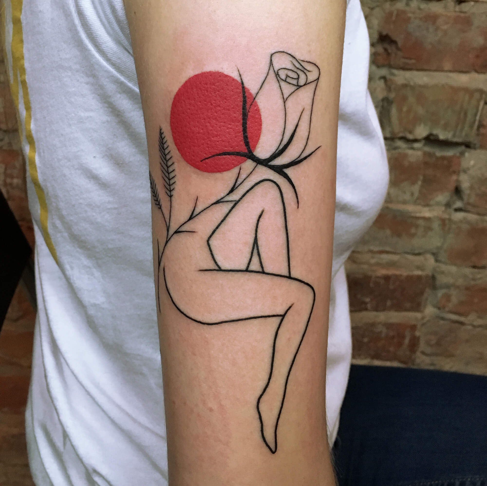
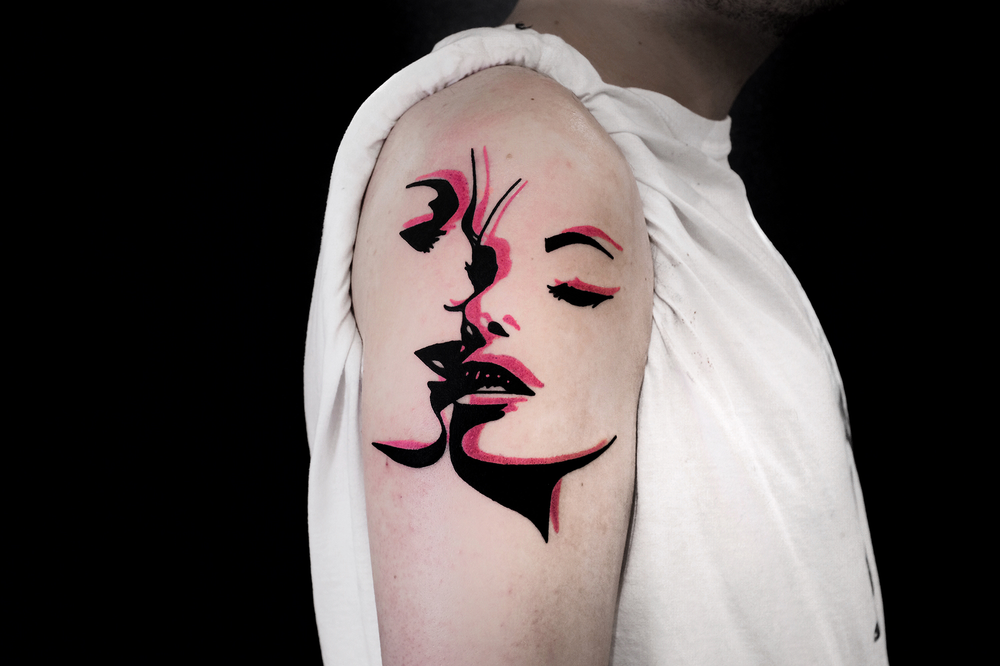

# Tattoos

The tattoo industry has grown immensely in the last decade. I won't comment on why someone gets a tattoo, but whatever the reason, a culture that at least tolerates them now has birthed and raised attention to incredible artists. Here is some work I like.

#### [Marius Trubisz](https://scene360.com/art/108905/mariusz-trubisz/)

#### [Francesco Rosetti](https://scene360.com/art/112488/francesco-rossetti/)

#### [The Wolf Rosario](https://scene360.com/art/114161/the-wolf-rosario/)

#### 

#### 

